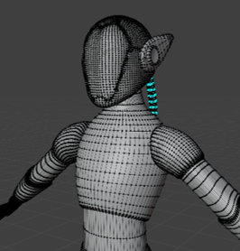
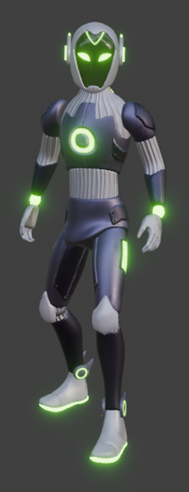
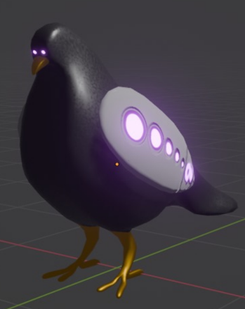
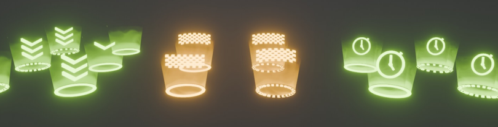
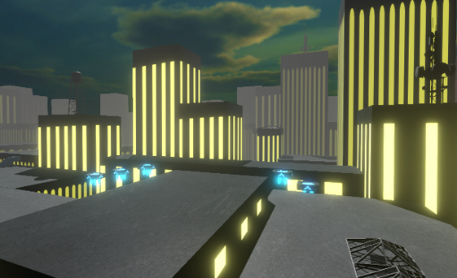

# CyberSurge: Game Development Report

## Introduction
CyberSurge is a cyberpunk-inspired parkour game developed as part of our Creative-Code-Lab. The game immerses players in a dark, neon-lit cityscape where they must navigate various parkour courses, racing against the clock to achieve the fastest times.

## Game Overview
### Concept
CyberSurge combines the thrill of parkour with the aesthetics of a cyberpunk world. Players explore a sprawling city at night, characterized by its dark ambiance and glowing neon signs, to discover and complete challenging parkour courses.

### Objective
The primary objective of CyberSurge is to complete parkour courses as quickly as possible. Players must locate the courses scattered throughout the city and traverse them efficiently to achieve the best times.

## Development Process
### Planning
We began by brainstorming the core mechanics and visual style of the game. The cyberpunk theme was chosen for its visually appealing and immersive qualities. We decided on parkour as the primary gameplay mechanic to provide a dynamic and engaging player experience.

### Design
Our design phase focused on creating a detailed city environment that felt alive and intricate. We designed multiple parkour courses with varying levels of difficulty, ensuring each course offered a unique challenge. Key design elements included:
- **City Layout:** A sprawling urban landscape with interconnected rooftops.
- **Parkour Courses:** Distinct routes featuring jumps, wallruns, and other obstacles.
- **Visuals:** Dark, moody environments illuminated by vibrant lights.

### Development
The development phase involved bringing our designs to life using Blender and Unity. Key steps included:
- **Environment Modeling:** Creating detailed 3D models of the characters, obstacles, the city and parkour courses.
- **Mechanics Implementation:** Coding the parkour mechanics, including jumping, wallrunning, and timing systems.
- **Testing:** Conducting playtesting to refine mechanics and fix bugs.

### Challenges
Throughout the development process, we encountered several challenges:
- **World Building:** Building a whole City and balancing the difficulty of parkour courses to ensure they were playable.
- **Animation:** Creating all the different animations and make them according to our high standards.
- **Movement:** Developing a movement mechanic that feels as smooth as we wanted it.

## Features
### Key Features
- **Dynamic Parkour Mechanics:** Fluid controls for a realistic parkour experience.
- **Timer System:** Tracks and displays the player's time for each course, encouraging replayability and competition.
- **Cyberpunk Aesthetics:** A visually stunning city with neon lights and dark, atmospheric environments.
- **Exploration:** A **large**, open-world city for players to explore and discover new parkour courses.

### Visuals and Audio
- **Graphics:** 3D models and textures to create a detailed urban environment.
- **Soundtrack:** An immersive soundtrack featuring electronic and synthwave music to enhance the cyberpunk atmosphere.
- **Sound Effects:** Realistic sound effects for footsteps, jumps, and environmental interactions.

## Conclusion
Developing CyberSurge was a challenging yet rewarding experience. Our team successfully created a captivating parkour game set in a visually striking cyberpunk world. We learned valuable lessons in game design, development, and teamwork, which will undoubtedly benefit us in our future endeavors.

## Team Members
- **Lukas Gruber:** Lead Developer
- **Manuel Prammer:** Game Design, Audio Design, Artist support
- **Samy Schiphorst:** Game Artist

## Screenshots and Media

## Development Journal
### Week 1

**Manuel – Game & Audio Designer**
1. Asset modelling: checkpoints, pipes, jump pads
2. UV unwrapping & Texture mapping
3. Asset modelling: map buildings
4. Texturing

**Samy – Game Artist**
1. (Before week 1) Concept art for character & environment, first presentation
2. Character modelling: Cyber-Steve
3. UV unwrapping
4. Texture mapping: color, bumps, emission, roughness
5. Rigging

**Lukas – Lead Developer**
1. Smooth character movement: move, jump
2. Smooth camera functionalities
3. Basic functionality for parkour courses
4. High score board functionality
5. JSON implementation for checkpoints

### Week 2

**Manuel – Game & Audio Designer**
1. World building: map design
2. Unity: working on shaders and better emission
3. Character modelling: Cyber-Bob, the pigeon
4. Texturing
5. Animation: idle, fly away
6. Game audio: finding & implementing sounds

**Samy – Game Artist**
1. Character animation: idle, run, jump
2. UI design
3. Implementing map details
4. Character animation: wall run
5. Final presentation
6. Promotion video

**Lukas – Lead Developer**
1. Menu & scene change functionalities
2. Character functionalities: Cyber-Bob (pigeon) & Cyber-Bert (robot)
3. Timer implementation
4. Wall run implementation
5. Bug fixes

---

We hope you enjoy playing CyberSurge as much as we enjoyed creating it!
